# Push to Upstream Workflow

This document provides a detailed breakdown of the `push-to-upstream.js` script
workflow and its features.

## Core Workflow Steps

1. **Branch Selection**
   - Identifies branches with prefix `pull-from-upstream`
   - If multiple branches exist, prompts user to select which one to use
   - Exits if no appropriate branch is found

2. **Backup Creation**
   - Creates a backup of the selected pull branch as `backup-{branchName}`
   - If a backup with that name already exists, adds timestamp to make it unique

3. **Target Branch Setup**
   - Creates a new branch named `push-to-upstream` based on upstream/main
   - If the branch already exists, suggests a numbered alternative (e.g.,
     push-to-upstream-1)

4. **File Copying Process [Updated 2023-12-03]**
   - Detects changes between upstream/main and the pull branch
   - Provides detailed information about changes:
     - File types changed
     - Directories with changes and file counts
     - Counts of new, modified, and deleted files

5. **File Filtering Options [Updated 2023-12-03]**
   - Allows filtering files before copying
   - Supports numerical selection of directories:
     - Use directory numbers instead of paths (e.g., "6,7" selects directories
       #6 and #7)
     - Range selection (e.g., "1-5" selects directories #1 through #5)
     - Exclusions with ! prefix (e.g., "!2" excludes directory #2)
     - Combined patterns (e.g., "1-10,!3,!5-7" includes #1-10 except #3 and
       #5-7)
   - Respects directory boundaries (selecting a directory does not automatically
     include its subdirectories)
   - Supports multiple filtering iterations

6. **File Processing**
   - Copies selected files from pull branch to the current working directory
   - Handles new, modified, and deleted files appropriately
   - Provides summary of processed files

7. **Changes Review**
   - Displays statistics about staged changes
   - Prompts user to commit changes in VS Code
   - Offers option to copy more files in an iterative process

8. **Push Options**
   - Push to a new feature branch in upstream (safer option)
     - Generates suggested branch name based on repository name and date
     - Allows customization of the target branch name
   - Push directly to upstream/main (requires confirmation)

9. **Cleanup**
   - Option to clean up temporary branches
   - Returns to dev branch if cleanup is confirmed
   - Deletes temporary branches used in the process

## Key Features

### Repository Identification

- Attempts to determine repository name from:
  - Directory name
  - Origin remote URL
  - Package.json name field
  - Falls back to generic name with timestamp

### File Management [Updated 2023-12-03]

- Detects file status (new/modified/deleted)
- Provides comprehensive filtering system with numbered directories
- Groups changes by directory with file counts
- Shows file type distribution
- Handles file deletion correctly

### Directory Organization [New 2023-12-03]

- Displays numbered directory list with file counts
- Maintains directory structure during filtering operations
- Supports precise directory targeting without including subdirectories
- Allows for complex include/exclude patterns using directory numbers

### Error Handling

- Tracks success and error counts during file processing
- Provides detailed error messages
- Graceful handling of common issues

### User Interaction

- Interactive prompts for important decisions
- Confirmation for potentially destructive actions
- Detailed summaries and statistics

### Branch Management

- Automatic backup creation
- Conflict avoidance through branch name suggestions
- Optional cleanup of temporary branches

## Common Use Cases

1. **Synchronizing a Fork with Upstream**
   - After pulling changes from upstream into a temporary branch
   - Selecting specific changes to incorporate
   - Pushing selected changes back to upstream

2. **Selective Feature Integration**
   - Choosing specific files or directories to integrate
   - Reviewing changes before committing
   - Creating a feature branch for review

3. **Contribution Workflow**
   - Making changes in a local fork
   - Filtering changes to include only relevant files
   - Creating upstream pull requests for review

## Mermaid Diagram:

```mermaid
flowchart TD
    Start([Start]) --> CheckBranch{Find pull-from-upstream<br>branches}
    CheckBranch -->|None found| Error1[Exit: No branch found]
    CheckBranch -->|One found| SelectBranch1[Use found branch]
    CheckBranch -->|Multiple found| ListBranches[List available branches]
    ListBranches --> UserSelect[User selects branch]
    UserSelect --> SelectBranch1
    
    SelectBranch1 --> CreateBackup[Create backup of<br>pull branch]
    
    CreateBackup --> CheckTargetBranch{push-to-upstream exists?}
    CheckTargetBranch -->|Yes| SuggestNewName[Suggest numbered<br>alternative]
    CheckTargetBranch -->|No| CreateTarget[Create push-to-upstream<br>based on upstream/main]
    SuggestNewName --> UserConfirm{User confirms?}
    UserConfirm -->|Yes| CreateTarget
    UserConfirm -->|No| Exit1[Exit]
    
    CreateTarget --> DetectChanges[Detect changes between<br>upstream/main and pull branch]
    
    DetectChanges --> ShowSummary[Show summary of changes:<br>- File types<br>- Directories with counts<br>- Counts by status]
    
    ShowSummary --> FilterOptions{Filter files?}
    FilterOptions -->|Yes| NumberedFilter["Filter by directory numbers:<br>- Single: 1,2,5<br>- Range: 1-5<br>- Exclude: !3<br>- Complex: 1-10,!5-7"]
    FilterOptions -->|No| CopyAll[Process all files]
    
    NumberedFilter --> ProcessFiles[Copy selected files]
    CopyAll --> ProcessFiles
    
    ProcessFiles --> ShowStats[Show stats of<br>processed files]
    
    ShowStats --> ReviewChanges[Review staged changes]
    
    ReviewChanges --> CommitPrompt{Commit in<br>VS Code?}
    CommitPrompt -->|Not yet| WaitForCommit[Wait for user to commit]
    CommitPrompt -->|Done| AskCopyMore{Copy more<br>files?}
    WaitForCommit --> AskCopyMore
    
    AskCopyMore -->|Yes| FilterOptions
    AskCopyMore -->|No| PushOptions{Push to<br>upstream?}
    
    PushOptions -->|Feature branch| CreateFeatureBranch[Generate branch name<br>based on repo]
    PushOptions -->|Main branch| ConfirmMainPush{Confirm push<br>to main?}
    
    CreateFeatureBranch --> CustomizeName[Allow custom branch name]
    CustomizeName --> PushToRemote[Push to remote]
    
    ConfirmMainPush -->|Yes| PushToMain[Push to upstream/main]
    ConfirmMainPush -->|No| SkipPush[Skip push]
    
    PushToRemote --> CleanupPrompt{Clean up<br>branches?}
    PushToMain --> CleanupPrompt
    SkipPush --> CleanupPrompt
    
    CleanupPrompt -->|Yes| CleanupBranches[Return to dev<br>Delete temp branches]
    CleanupPrompt -->|No| KeepBranches[Keep branches]
    
    CleanupBranches --> End([End])
    KeepBranches --> End
```

